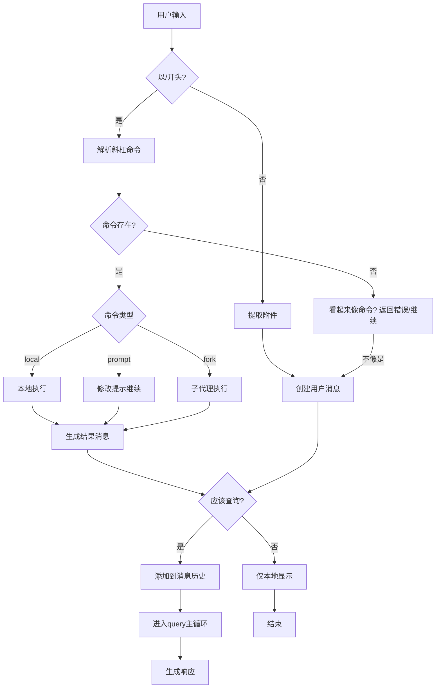
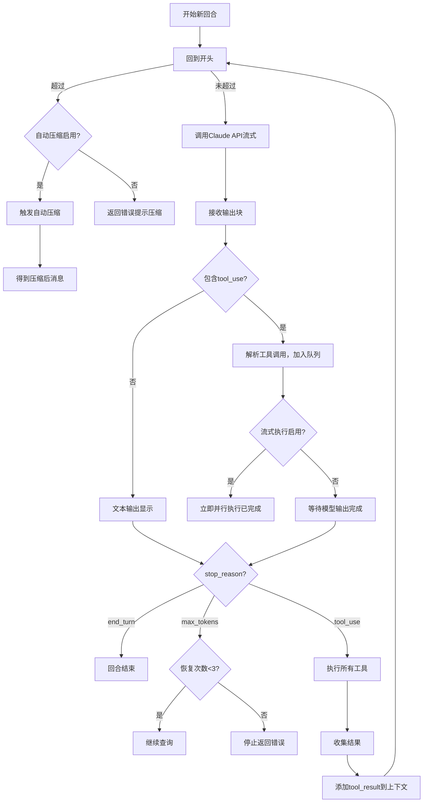
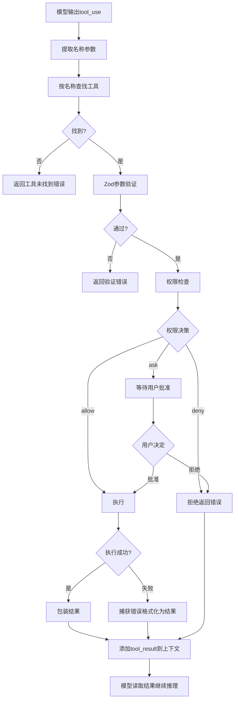
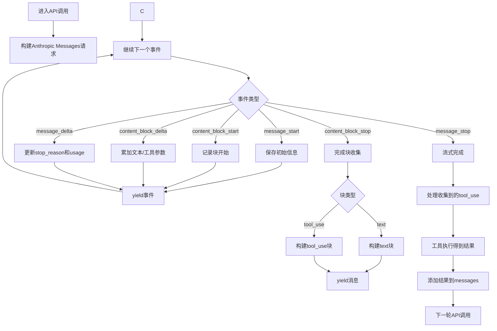
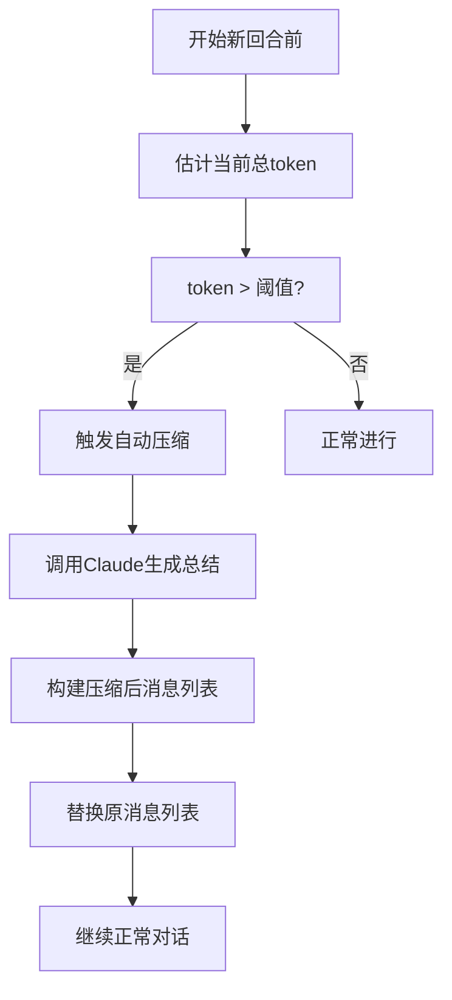
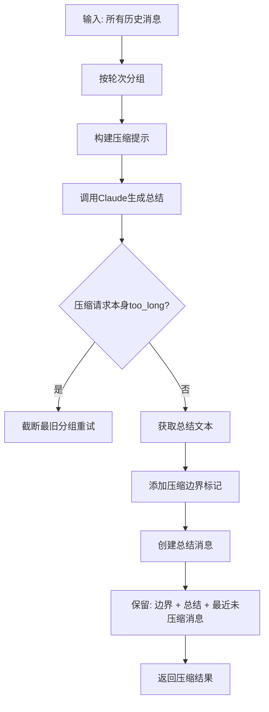

# Claude CLI 功能分析报告

**项目**: Claude CLI 源代码系统性分析与重构  
**日期**: 2026-04-01  
**分析范围**: `d:\Users\han.tang\Downloads\claude-code\claude-code` (排除 `agent` 目录)

---

## 目录

1. [项目概述](#1-项目概述)
2. [整体架构](#2-整体架构)
3. [提示词系统分析](#3-提示词系统分析)
4. [工具系统分析](#4-工具系统分析)
5. [技能系统分析](#5-技能系统分析)
6. [核心运行机制](#6-核心运行机制)
7. [状态管理](#7-状态管理)
8. [上下文压缩机制](#8-上下文压缩机制)
9. [安全与权限系统](#9-安全与权限系统)
10. [功能完整性总结](#10-功能完整性总结)

---

## 1. 项目概述

### 1.1 项目简介

Claude CLI 是 Anthropic 开发的命令行界面版本的 Claude Code，它允许用户通过终端与 Claude AI 助手进行交互，并提供完整的本地文件系统访问和工具执行能力。主要特点：

- 基于 Anthropic Claude API（Claude 3/3.5 系列模型）
- 完整的工具调用系统，支持文件操作、命令执行、网络搜索等
- 交互式终端UI，基于 Ink + React 构建
- 支持上下文自动压缩，处理长对话
- 支持斜杠命令和技能系统，可扩展性强
- 支持子代理和多代理协作

### 1.2 技术栈

| 层级 | 技术 | 说明 |
|------|------|------|
| 语言 | TypeScript | 整个项目使用 TypeScript 开发 |
| UI框架 | React + Ink | 终端交互式UI |
| 类型验证 | Zod | 工具参数schema验证 |
| API调用 | @anthropic-ai/sdk | 官方Anthropic SDK |
| 状态管理 | 自定义Store | 不可变更新模式 |
| 文件搜索 | ripgrep | 高性能正则搜索 |

---

## 2. 整体架构

### 2.1 目录结构

```
src/
├── cli.tsx                      # CLI入口
├── main.tsx                     # REPL主入口
├── QueryEngine.ts               # 查询引擎，管理对话
├── query.ts                     # 主查询循环
├── Tool.ts                      # 工具接口定义
├── tools.ts                     # 工具注册表
├── context.ts                   # React上下文
├── constants/
│   └── prompts.ts              # 系统提示模板
├── tools/                       # 各个工具实现
│   ├── */index.ts              # 工具定义
│   └── */prompt.ts             # 工具提示词
├── skills/
│   ├── bundledSkills.ts        # 捆绑技能注册表
│   └── bundled/               # 各个技能实现
├── services/
│   ├── api/
│   │   └── claude.ts          # Claude API调用
│   ├── tools/
│   │   ├── toolExecution.ts   # 工具执行器
│   │   └── StreamingToolExecutor.ts  # 流式执行器
│   └── compact/
│       ├── compact.ts         # 对话压缩
│       └── autoCompact.ts     # 自动压缩触发检查
├── state/
│   └── AppStateStore.ts       # 全局状态定义
└── utils/
    ├── processUserInput/      # 用户输入处理
    └── sessionStorage.ts      # 会话持久化
```

### 2.2 架构层次

```
┌─────────────────────────────────┐
│     用户输入 / CLI入口            │
└──────────────┬──────────────────┘
               │
┌──────────────▼──────────────────┐
│   输入处理 / 斜杠命令解析          │
└──────────────┬──────────────────┘
               │
┌──────────────▼──────────────────┐
│          QueryEngine            │
└──────────────┬──────────────────┘
               │
┌──────────────▼──────────────────┐
│ 主循环 query() 核心控制          │
│  ┌────────────────────────────┐  │
│  │  Token检查                  │  │
│  │  自动压缩检查                │  │
│  │  Claude API调用             │  │
│  │  工具调用解析                │  │
│  │  工具权限检查 + 执行         │  │
│  │  结果返回模型继续推理         │  │
│  └────────────────────────────┘  │
└──────────────┬──────────────────┘
               │
┌──────────────▼──────────────────┐
│        结果输出到UI              │
└─────────────────────────────────┘
```

---

## 3. 提示词系统分析

### 3.1 提示模板统计

总共提取到 **62+** 个独立提示模板分布在 **45** 个文件中：

| 分类 | 数量 | 说明 |
|------|------|------|
| 系统提示 | 1+ | 主系统提示由多个函数动态拼接 |
| 工具特定提示 | 36 | 每个工具一个提示描述文件 |
| 服务相关提示 | 4 | 压缩、内存提取、Magic Docs等 |
| 其他提示 | 4 | 伴侣、浏览器自动化等 |

### 3.2 核心系统提示结构

系统提示在 [`src/constants/prompts.ts`](file:///d:/Users/han.tang/Downloads/claude-code/claude-code/src/constants/prompts.ts) 中由多个函数动态拼接：

```
┌──────────────────────────────────────────────────────────┐
│  getSimpleIntroSection()          - 简介介绍              │
│  getSimpleSystemSection()         - 基础系统说明         │
│  getSimpleDoingTasksSection()     - 任务执行指南         │
│  getActionsSection()              - 谨慎操作指南         │
│  getUsingYourToolsSection()       - 工具使用指南         │
│  getAgentToolSection()            - 子agent说明          │
│  getSessionSpecificGuidanceSection() - 会话特定指南      │
│  getOutputEfficiencySection()     - 输出效率说明         │
│  getSimpleToneAndStyleSection()   - 语气风格说明         │
└──────────────────────────────────────────────────────────┘
```

**动态生成特点**:
- 静态缓存 + 动态生成分离：`SYSTEM_PROMPT_DYNAMIC_BOUNDARY` 分隔
- 根据环境变量和功能标志条件性包含章节
- 根据操作系统注入正确的shell信息
- 根据模型注入正确的知识截止日期
- 根据功能开关（PROACTIVE, KAIROS, TOKEN_BUDGET）条件性添加内容

### 3.3 工具提示模式

每个工具在 `src/tools/ToolName/prompt.ts` 中定义自己的提示：

- **用途**: 告诉模型工具的作用、使用时机、参数规范
- **格式**: 纯文本markdown格式，插入到系统提示的工具部分
- **动态生成**: 某些工具需要根据环境变量动态生成（如ConfigTool列出所有可配置设置）
- **预算控制**: SkillTool 根据上下文窗口大小动态截断技能描述列表

### 3.4 服务提示

服务相关的提示包括：

1. **extractMemories**: 后台自动提取记忆，总结对话保存到持久化内存
2. **compact**: 对话压缩，当上下文满时生成摘要
3. **MagicDocs**: 自动更新项目文档
4. **SessionMemory**: 自动更新会话笔记

### 3.5 提示模板总结

| 特点 | 说明 |
|------|------|
| **模块化** | 每个模块负责自己的提示，易于维护 |
| **动态化** | 根据环境、功能、用户配置动态生成 |
| **缓存友好** | 静态部分缓存，只重新计算动态部分 |
| **可扩展** | 新增工具只需要新增提示文件 |

---

## 4. 工具系统分析

### 4.1 工具总数

原始项目中共有 **68** 个工具定义。其中核心工具包括：

### 4.2 工具架构

工具定义遵循接口模式：

```typescript
interface Tool {
  name: string;
  description: string;
  inputSchema: z.ZodObject;
  outputSchema: z.ZodType;
  maxResultSizeChars: number;
  isConcurrencySafe: boolean | ((input) => boolean);
  
  checkPermissions(input, context): PermissionResult;
  execute(input, context): AsyncGenerator<ToolResult> | ToolResult;
  isReadOnly(input): boolean;
}
```

### 4.3 核心工具分类

| 类别 | 工具名称 | 功能说明 |
|------|---------|----------|
| **文件操作** | read | 读取文件，支持范围读取 |
| | write | 写入新文件或覆盖 |
| | edit | 精确搜索替换编辑 |
| | notebook_edit | Jupyter笔记本单元格编辑 |
| **搜索** | glob | 按glob模式匹配文件路径 |
| | grep | 正则表达式搜索内容 |
| | ls | 列出目录内容 |
| | search_codebase | 嵌入向量搜索 |
| **命令执行** | bash | Bash命令执行 |
| | powershell | PowerShell命令执行 |
| **网络** | web_search | 网络搜索 |
| | web_fetch | 获取网页内容 |
| **任务管理** | todo_write | 管理待办事项列表 |
| | task_create / task_get / task_list / task_update / task_stop | 完整任务管理 |
| **代理协作** | agent | 启动子代理 |
| | team_create / team_delete | 创建/删除团队 |
| | send_message | 发送消息给其他代理 |
| **模式切换** | enter_plan_mode / exit_plan_mode | 进入/退出规划模式 |
| | enter_worktree / exit_worktree | Git worktree切换 |
| **配置** | config | 修改简单配置 |
| **MCP** | mcp | 调用MCP服务器工具 |
| | list_mcp_resources / read_mcp_resource | MCP资源访问 |
| **其他** | think | 内部思考 |
| | skill | 调用技能 |
| | cron_create / cron_delete / cron_list | Cron定时任务 |
| | sleep | 暂停执行 |

### 4.4 工具调用流程

```
模型输出tool_use → 提取名称和参数 → 查找工具 → Zod验证 → 权限检查 → 执行 → 结果包装 → tool_result返回模型
```

### 4.5 流式工具执行

Claude CLI 支持 **流式并行工具执行**:

- 模型还在输出时，只要一个完整的 `tool_use` 块接收完成就立即开始执行
- 多个工具可以并行执行
- 执行过程中的进度可以实时推送到UI
- 优势: 减少用户等待时间，特别适合多个小工具调用场景

---

## 5. 技能系统分析

### 5.1 技能定义

技能是预定义的斜杠命令，封装了特定的工作流。原始项目共有 **15** 个捆绑技能：

| 技能名称 | 功能说明 |
|---------|----------|
| **batch** | 批量处理，使用子代理并行执行多个任务 |
| **claude-api** | Claude API开发帮助，提供多语言代码示例 |
| **claude-in-chrome** | 自动化Chrome浏览器交互 |
| **debug** | 调试当前Claude Code会话 |
| **keybindings-help** | 自定义键盘快捷键帮助 |
| **loop** | 按定时间隔重复运行提示 |
| **lorem-ipsum** | 生成填充文本用于长上下文测试 |
| **remember** | 整理自动记忆，升级到CLAUDE.md |
| **schedule** | 创建管理定时远程代理 |
| **simplify** | 代码审查改进，提高复用性和质量 |
| **skillify** | 捕获可重复过程创建新技能 |
| **stuck** | 诊断卡住的Claude Code会话 |
| **update-config** | 帮助配置Claude Code设置 |
| **verify** | 验证代码更改符合预期 |

### 5.2 技能架构

```typescript
interface Skill {
  name: string;
  description: string;
  getPromptForCommand(args: string): string | Promise<string>;
  allowedTools?: string[];
  isEnabled?: () => boolean;
}
```

### 5.3 技能调用流程

1. 用户输入 `/skillname args`
2. 解析斜杠命令，找到技能
3. 调用 `getPromptForCommand(args)` 获取提示
4. 修改系统提示或用户提示后继续对话
5. 有些技能(local类型)直接在本地执行

### 5.4 扩展性

- 用户可以在配置目录添加自定义技能
- 技能可以动态加载，不需要重新编译
- 每个技能可以定义允许使用的工具列表

---

## 6. 核心运行机制

### 6.1 用户输入处理流程



### 6.2 主循环决策流程



### 6.3 工具调用详细流程



### 6.4 流式响应处理



**架构特点**:
- 全程使用 `async function*` 异步生成器
- 每个流式事件yield给UI层，实现逐字显示
- 通过 `AbortController` 支持随时取消

---

## 7. 状态管理

### 7.1 状态分层

| 层次 | 位置 | 说明 |
|------|------|------|
| **应用级状态** | AppStateStore | 全局配置、对话列表、任务、权限、MCP连接 |
| **对话级状态** | QueryEngine | 每个对话维护实例，持有messages、token统计 |
| **回合级状态** | query()函数内 | 每个用户回合维护可变状态 |
| **工具级状态** | ToolContext | 传递给工具执行的上下文，包含abortController |

### 7.2 状态更新模式

- 使用不可变更新模式：`setAppState(prev => ({...prev, ...changes}))`
- 订阅模式：React组件通过 `useAppStore(selector)` 订阅变化
- 只有选中值变化才触发重新渲染，性能优化

### 7.3 持久化

- 每次消息更新后持久化对话记录到 `~/.claude/sessions/`
- 程序重启后可以恢复对话状态
- 支持将会话导出/导入

---

## 8. 上下文压缩机制

### 8.1 触发流程



### 8.2 压缩算法



### 8.3 压缩结构

```
[compact_boundary]
[user] 这里是整个对话的总结...
[ ... 最新的几轮消息保持不变 ... ]
```

### 8.4 关键参数

```typescript
const MAX_OUTPUT_TOKENS_FOR_SUMMARY = 20_000
// 自动压缩阈值 = 有效上下文窗口 × 配置比例
```

### 8.5 压缩类型

| 类型 | 触发时机 |
|------|----------|
| **自动压缩** | 每回合开始前检查，超过阈值自动触发 |
| **手动压缩** | 用户执行 `/compact` 命令 |
| **部分压缩** | 支持只压缩某段历史 |
| **反应式压缩** | API返回 `prompt_too_long` 才触发压缩 |

---

## 9. 安全与权限系统

### 9.1 权限检查流程

1. **工具级检查**: 工具自定义 `checkPermissions()` 方法
2. **全局规则匹配**: 用户配置的 `alwaysAllow` / `alwaysDeny`
3. **ask决策**: 如果结果是 `ask`，UI弹出对话框让用户批准

### 9.2 权限行为

```typescript
type PermissionBehavior = 'allow' | 'deny' | 'ask'
```

- **allow**: 允许执行，不需要用户确认
- **deny**: 拒绝执行，直接返回错误
- **ask**: 需要交互式用户批准

### 9.3 安全限制

- 文件读取大小限制，防止爆上下文
- 大工具结果自动持久化到磁盘，不占用上下文
- 危险操作默认需要批准
- 支持按工作区配置独立权限规则

---

## 10. 功能完整性总结

### 10.1 已识别功能清单

| 功能模块 | 状态 |
|----------|------|
| 完整工具调用系统 | ✅ 识别完成，68个工具 |
| 流式API响应 | ✅ 完整异步生成器架构 |
| 并行流式工具执行 | ✅ 识别完整 |
| 自动上下文压缩 | ✅ 完整压缩算法 |
| 权限检查系统 | ✅ 三级权限模型 |
| 斜杠命令系统 | ✅ 识别完整 |
| 技能系统 | ✅ 15个捆绑技能 |
| 子代理/多代理协作 | ✅ 识别完整 |
| 会话持久化 | ✅ 识别完整 |
| MCP外部工具集成 | ✅ 识别完整 |

### 10.2 核心设计特点

1. **模型驱动决策**: Claude模型自主决定何时调用工具、调用哪个工具，CLI只负责执行基础设施
2. **流式架构**: 全链路异步生成器，增量输出，响应迅速
3. **自动上下文管理**: 超出阈值自动压缩，用户不需要手动管理
4. **分层权限安全**: 工具级检查 + 全局规则 + 用户确认，多层保护
5. **不可变状态更新**: 遵循React最佳实践，可预测

### 10.3 系统能力边界

**Claude CLI 能够**:
- 完整的文件系统读写编辑搜索
- 本地执行Bash/PowerShell命令
- 通过LSP获取代码智能
- 连接外部MCP服务器扩展能力
- 多代理并行协作
- 自动压缩超长对话
- 自定义技能和斜杠命令

**Claude CLI 不能够**:
- 绕过权限检查执行危险操作
- 访问本地GUI桌面（需要额外MCP）
- 突破Anthropic API上下文窗口限制
- 离线运行（需要连接Anthropic API）

---

**报告完成**  
*功能分析报告 - 结束*
