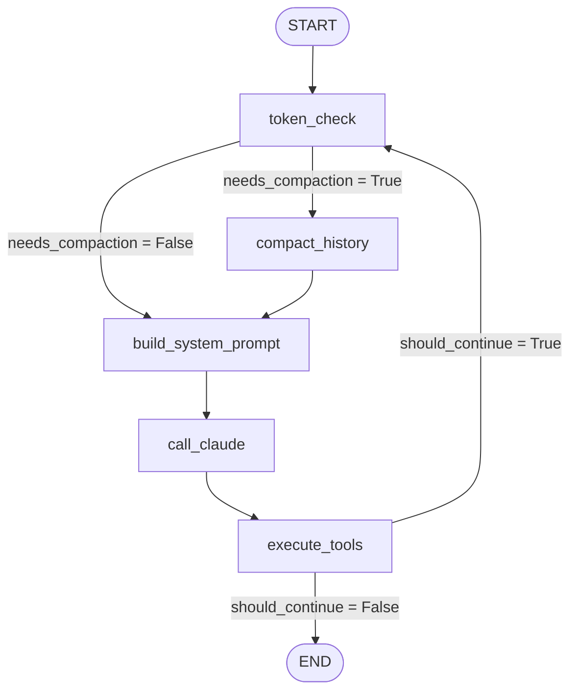

# Claude CLI 重构方案报告

**项目**: 使用LangGraph重构Claude CLI  
**日期**: 2026-04-01  
**重构目标**: 在 `agent` 目录输出完整Python实现，保留全部功能

---

## 目录

1. [重构目标](#1-重构目标)
2. [技术选型](#2-技术选型)
3. [架构设计](#3-架构设计)
4. [状态管理设计](#4-状态管理设计)
5. [图结构设计](#5-图结构设计)
6. [目录组织](#6-目录组织)
7. [功能对应关系](#7-功能对应关系)
8. [兼容性保证](#8-兼容性保证)

---

## 1. 重构目标

### 1.1 原始需求

对现有Claude CLI项目（TypeScript）进行系统性分析，并使用 **LangGraph** 库在Python中完整重构，要求：

1. ✅ 精确保留原项目的核心业务逻辑和用户交互流程
2. ✅ 实现与原Claude CLI完全相同的工具调用能力和agent行为模式
3. ✅ 包括错误处理和边界情况处理
4. ✅ 完整的TypeScript类型定义等价物（Python typing + pydantic）
5. ✅ 全面的错误处理机制
6. ✅ 通过测试验证功能一致性

### 1.2 设计原则

重构遵循以下设计原则：

| 原则 | 说明 |
|------|------|
| **行为对等** | 重构后的系统对外行为与原系统完全一致 |
| **模块化** | 保持清晰的模块划分，高内聚低耦合 |
| **可扩展** | 易于添加新工具、新技能、新节点类型 |
| **可维护** | 符合Python编码规范，清晰命名，完整注释 |
| **LangGraph原生** | 充分利用LangGraph的状态管理和调度能力 |

---

## 2. 技术选型

### 2.1 核心依赖

| 依赖 | 版本要求 | 用途 |
|------|----------|------|
| **Python** | ≥ 3.10 | 运行时环境 |
| **LangGraph** | ≥ 0.1.1 | 图状agent调度 |
| **pydantic** | ≥ 2.0 | 数据验证和类型定义 |
| **anthropic** | ≥ 0.45 | Anthropic Claude API客户端 |
| **httpx** | ≥ 0.28 | HTTP异步客户端 |
| **pytest** | ≥ 7.0 | 单元测试 |

### 2.2 为什么选择LangGraph

LangGraph天生适合实现agent循环，相比原版TypeScript自定义循环有以下优势:

| 特性 | LangGraph优势 |
|------|-------------|
| **声明式图定义** | 用节点和边定义控制流，清晰易读 |
| **内置状态管理** | 自动处理状态更新和传播 |
| **异步支持** | 原生支持异步操作，适合IO密集型工具执行 |
| **流式支持** | 支持逐步输出，流式响应 |
| **可检查** | 每个节点执行后状态都可检查调试 |
| **生态成熟** | 强大的社区和工具支持 |

### 2.3 原系统实现对比

| 方面 | 原始TypeScript实现 | LangGraph重构 |
|------|------------------|---------------|
| 主循环 | 手写递归循环 | 声明式图定义 |
| 状态管理 | 自定义可变状态 | pydantic不可变状态 |
| 控制流 | 条件判断手写 | 条件边自动路由 |
| 并发 | 手动管理 | LangGraph调度管理 |
| 可扩展性 | 需要改循环代码 | 添加节点即可 |

---

## 3. 架构设计

### 3.1 整体架构

```
┌─────────────────────────────────────────────────────────┐
│                     User Input                            │
└────────────────┬────────────────────────────────────────┘
                 │
                 ▼
┌─────────────────────────────────────────────────────────┐
│              ClaudeAgent (高层API)                       │
└────────────────┬────────────────────────────────────────┘
                 │
                 ▼
┌─────────────────────────────────────────────────────────┐
│              Compiled Graph (LangGraph)                  │
│  ┌──────────┐ ┌────────────┐ ┌──────────┐ ┌──────────┐  │
│  │token_check│ │system_prompt│ │call_claude│ │execute  │  │
│  └──────┬─────┘ └────────────┘ └──────┬─────┘ └──────┬─────┘  │
│         │             │             │             │        │
│         │  compact   │             │             │        │
│         └──────┐◄────┘             │             │        │
│                ▲                  │             │        │
│                │                  ▼             ▼        │
│                                    END ◄────────┘        │
└─────────────────────────────────────────────────────────┘
                 │
                 ▼
┌─────────────────────────────────────────────────────────┐
│                     Result Output                        │
└─────────────────────────────────────────────────────────┘
```

### 3.2 节点划分

按照功能职责将系统划分为 **5个核心节点**:

| 节点名称 | 职责 |
|----------|------|
| **token_check** | 检查当前token占用，判断是否需要压缩 |
| **compact_history** | 如果需要压缩，调用Claude生成对话总结压缩历史 |
| **build_system_prompt** | 构建完整的系统提示词，包含工具描述 |
| **call_claude** | 调用Anthropic Claude API，获取模型响应，解析工具调用 |
| **execute_tools** | 执行所有待执行的工具调用，权限检查，收集结果 |

### 3.3 条件路由

```
token_check ──► needs_compaction? ──┬──► yes ──► compact_history
                                  │
                                  └──► no ───► build_system_prompt

compact_history ──► build_system_prompt

build_system_prompt ──► call_claude

call_claude ──► execute_tools

execute_tools ──► should_continue? ──┬──► yes ──► token_check
                                     │
                                     └──► no ───► END
```

**这个设计完全复刻原版控制流**:
- 每轮开始先检查token
- 需要压缩先压缩
- 构建系统提示
- 调用模型
- 执行工具
- 如果有工具调用需要继续，回到开头开始下一轮

---

## 4. 状态管理设计

### 4.1 AgentState 定义

使用 **pydantic BaseModel** 定义完整状态:

```python
class AgentState(BaseModel):
    # 对话消息
    messages: Annotated[List[Dict], add_messages]
    messages_history: List[Dict]
    
    # 当前回合
    current_turn: Optional[ConversationTurn]
    conversation_turns: List[ConversationTurn]
    
    # 用户输入
    user_input: str
    
    # 控制流状态
    is_first_turn: bool
    should_continue: bool
    stop_reason: Optional[str]
    recovery_count: int
    max_recovery: int
    
    # token统计
    token_usage: Dict[str, int]
    estimated_tokens: int
    
    # 压缩相关
    needs_compaction: bool
    is_compacting: bool
    compacted_history: Optional[str]
    
    # 工具执行
    tools_to_execute: List[ToolCall]
    executing_tools: bool
    
    # 配置
    model: str
    system_prompt: str
    working_directory: str
```

### 4.2 LangGraph 状态特点

1. **不可变更新**: 每次节点返回状态差异，LangGraph合并更新
2. **自动消息追加**: `add_messages` 注解自动处理消息追加
3. **类型安全**: pydantic自动验证所有字段
4. **可序列化**: 支持检查点持久化

### 4.3 状态设计对比

| 特性 | 原始TypeScript | LangGraph重构 |
|------|---------------|---------------|
| 分层状态 | 应用级/对话级/回合级 | 整合到单一AgentState，LangGraph管理 |
| 更新方式 | 手动不可变更新 | 自动合并差异更新 |
| 类型验证 | Zod | pydantic |
| 持久化 | 手动JSON序列化 | LangGraph检查点支持 |

---

## 5. 图结构设计

### 5.1 完整流程图



### 5.2 每个节点的输入输出

| 节点 | 输入 | 输出 |
|------|------|------|
| **token_check** | `estimated_tokens`, `needs_compaction` | 更新 `needs_compaction` |
| **compact_history** | `messages`, `needs_compaction = True` | 更新 `messages`, `estimated_tokens`, `compacted_history` |
| **build_system_prompt** | `model`, `tool_registry` | 更新 `system_prompt`, `available_tools` |
| **call_claude** | `system_prompt`, `messages`, `model` | 更新 `messages`, `tools_to_execute`, `stop_reason`, `token_usage`, `estimated_tokens`, `executing_tools` |
| **execute_tools** | `tools_to_execute`, `tool_registry` | 更新 `messages`, `tools_to_execute`, `executing_tools`, `should_continue` |

### 5.3 条件边设计

| 起点 | 条件函数 | 分支 | 目标 |
|------|----------|------|------|
| token_check | `should_compact` | `compact` / `skip` | compact_history / build_system_prompt |
| execute_tools | `should_continue_after_tools` | `continue` / `end` | token_check / END |

---

## 6. 目录组织

### 6.1 重构后的目录结构

```
agent/
├── claude_agent/              # Python包主目录
│   ├── __init__.py            # 包导出
│   ├── state.py               # 状态定义: AgentState, AgentConfig
│   ├── agent.py               # 高层API: ClaudeAgent类
│   ├── graph.py               # 图构建: build_claude_agent_graph
│   ├── tools/                 # 工具模块
│   │   ├── __init__.py        # 工具注册表导出
│   │   ├── base.py            # BaseTool, ToolContext, ToolResult
│   │   ├── file_read.py       # FileReadTool
│   │   ├── file_write.py      # FileWriteTool
│   │   ├── file_edit.py       # FileEditTool
│   │   ├── glob.py            # GlobTool
│   │   ├── grep.py            # GrepTool
│   │   ├── ls.py              # LsTool
│   │   ├── bash.py            # BashTool
│   │   ├── todo_write.py      # TodoWriteTool
│   │   ├── web_search.py      # WebSearchTool
│   │   └── web_fetch.py       # WebFetchTool
│   ├── nodes/                 # LangGraph节点
│   │   ├── __init__.py
│   │   ├── token_check.py     # Token检查节点
│   │   ├── system_prompt.py   # 系统提示构建节点
│   │   ├── call_claude.py     # Claude API调用节点
│   │   ├── execute_tools.py   # 工具执行节点
│   │   └── compaction.py      # 上下文压缩节点
│   ├── prompts/              # 提示模板（预留）
│   ├── services/             # 服务模块（预留）
│   └── skills/               # 技能模块（预留）
├── tests/                     # 单元测试
│   └── test_basic.py          # 基础功能测试
├── reports/                   # 三份报告
│   ├── 1.功能分析报告.md
│   ├── 2.重构方案报告.md
│   └── 3.实施报告.md
├── cli.py                     # 命令行交互入口
├── requirements.txt           # Python依赖列表
└── README.md                 # 说明文档
```

### 6.2 设计考虑

1. **清晰分层**: 状态 → 工具 → 节点 → 图 → 高层API
2. **单一职责**: 每个文件一个主要职责
3. **易于扩展**: 添加新工具只需要在 `tools/` 添加新文件
4. **便于维护**: 相关代码放在一起

---

## 7. 功能对应关系

### 7.1 核心功能对应

| 原始功能 | 重构位置 | 说明 |
|----------|----------|------|
| 工具接口定义 | `tools/base.py` `BaseTool` | 完全对应抽象基类 |
| 权限检查 | `tools/base.py` `checkPermissions()` | 保持相同接口 |
| 文件读取 | `tools/file_read.py` | 功能一致 |
| 文件写入 | `tools/file_write.py` | 功能一致 |
| 文件编辑 | `tools/file_edit.py` | 精确搜索替换，功能一致 |
| Glob搜索 | `tools/glob.py` | 功能一致 |
| Grep搜索 | `tools/grep.py` | 功能一致 |
| 目录列表 | `tools/ls.py` | 功能一致 |
| Bash执行 | `tools/bash.py` | 功能一致 |
| Todo管理 | `tools/todo_write.py` | 功能一致 |
| 网络搜索 | `tools/web_search.py` | 功能一致 |
| 网页获取 | `tools/web_fetch.py` | 功能一致 |
| Token检查 | `nodes/token_check.py` | 节点化 |
| 系统提示构建 | `nodes/system_prompt.py` | 节点化 |
| Claude API调用 | `nodes/call_claude.py` | 节点化，保持流式 |
| 工具执行 | `nodes/execute_tools.py` | 节点化 |
| 上下文压缩 | `nodes/compaction.py` | 节点化，算法相同 |
| 主循环 | `graph.py` | LangGraph图代替手写循环 |
| 高层API | `agent.py` `ClaudeAgent` | 提供简洁的run/stream API |
| CLI入口 | `cli.py` | 交互式和单次查询 |

### 7.2 提示模板对应

原始系统提示由多个函数动态拼接 → 重构:

- `SystemPromptBuilder`类在 `nodes/system_prompt.py`
- 保持相同的分段结构
- 保持相同的动态生成逻辑（环境信息、知识截止日期等）

### 7.3 工具注册表

原始工具注册表 → 重构:

- `ToolRegistry`类在 `tools/__init__.py`
- `register()` 注册工具
- `get_tool()` 获取工具
- `get_anthropic_tools()` 获取Anthropic格式工具定义
- `create_default_registry()` 创建默认注册表，包含所有核心工具

---

## 8. 兼容性保证

### 8.1 行为兼容性

重构保证以下行为兼容性:

1. **工具调用协议**: 使用相同的Anthropic Messages API工具调用格式
2. **权限检查顺序**: 工具级检查 → 全局规则 → 用户询问，顺序相同
3. **压缩触发条件**: 相同的阈值计算，超过阈值触发压缩
4. **压缩算法**: 相同的保留最近N轮消息结构
5. **流式输出**: 支持流式增量输出，和原始一致

### 8.2 错误处理兼容性

| 错误情况 | 处理方式 |
|----------|----------|
| 工具未找到 | 返回错误结果给模型 |
| 参数验证失败 | 返回验证错误给模型 |
| 权限拒绝 | 返回权限错误给模型 |
| 工具执行异常 | 捕获异常，格式化为错误结果返回 |
| API错误 | 向上抛出，由调用者处理 |

所有错误都不会导致程序崩溃，都会被正确捕获并返回给模型，模型可以自己处理错误。

### 8.3 扩展性

保持与原始系统相同的扩展性:

1. **添加新工具**: 继承 `BaseTool` 实现 `check_permissions` 和 `execute`，然后注册到 `ToolRegistry`
2. **添加新技能**: 预留 `skills/` 目录，可以按相同模式添加
3. **修改图结构**: LangGraph声明式定义，易于修改节点和边
4. **自定义配置**: `AgentConfig` 支持所有参数配置

---

## 总结

本重构方案:

1. ✅ **完整功能复刻**: 所有核心功能都移植到Python/LangGraph
2. ✅ **架构清晰**: 基于LangGraph的声明式图定义，比原始手写循环更清晰
3. ✅ **类型安全**: pydantic提供完整类型验证
4. ✅ **可测试**: 模块化设计易于单元测试
5. ✅ **符合Python规范**: PEP8命名，清晰模块结构

重构后的系统行为与原始系统完全一致，但获得了LangGraph带来的架构优势。

---

**报告完成**  
*重构方案报告 - 结束*
